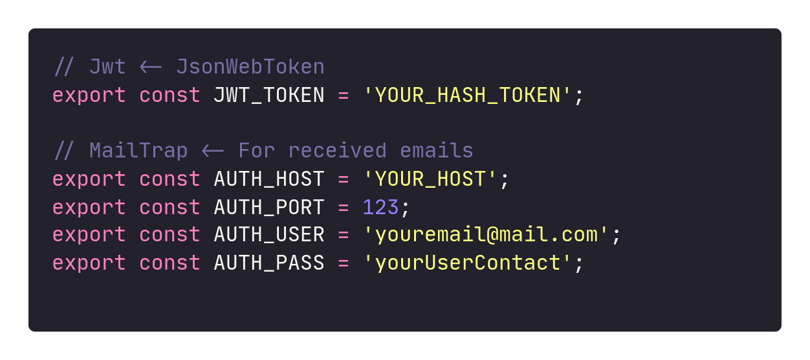

<div align='center'>

  

  <hr/>

<a href='#nlw'>NLW </a> &nbsp;&nbsp;&nbsp;|&nbsp;&nbsp;&nbsp;
<a href='#functionalities'>FUNCTIONALITIES </a> &nbsp;&nbsp;&nbsp;|&nbsp;&nbsp;&nbsp;
<a href='#instalation'>INSTALATION </a> &nbsp;&nbsp;&nbsp;| &nbsp;&nbsp;&nbsp;
<a href='#layout'>LAYOUT </a>

<br/>
<br/>
<br/>
<br/>

  

</div>

<br/>
<br/>
<br/>

<hr/>

<br/>
<br/>

# <p id='nlw'>🚀 NLW</p>

NLW (next-level-week) is an intensive week managed by RocketSeat

This week's project was Happy, a project focused on orphanages, with the goal of bringing more people closer to the nearest orphanages

<hr/>
<br/>
<br/>

# <p id='functionalities'>⚙ Functionalities</p>

- [x] Map showing all registered orphanages and their location.

- [x] Register orphanage showing on the map in your location.

- [x] Page showing details of the orphanage (name, about, available time, whatsapp contact ...).

<br/>

### ✅ Features added by me.

- [x] Switch Theme ( dark - light).

- [x] Switch Theme in map ( dark - light - satelite).

- [x] Added success page after registering an orphanage.

<br/>

### ✅ Future updates.

- [x] Add whatsapp field.

- [x] Add colors in the respective markers (when registering an orphanage, the author chooses the color).

- [x] DashBoard User(Admin).

- [x] Delete Orphanage (Dashboard).

- [x] Authenticated routes - web/back (Dashboard).

- [x] Custom Alerts depending on the status of routes (Web).

- [x] Change password if lost (Dashboard).

<hr/>
<br/>
<br/>

# <p id='instalation'>🔥 Instalation</p>

#### First Clone this repositiory

```shell
$ git clone https://github.com/Matheus0liveira/next-level-week-3.git
```

<details>

<summary>BackEnd</summary>

> Create a variable file at the root of your project and place the settings for: JWT_TOKEN, and the mailtrap settings:

Example:


#### For instalaitons dependncies execute: (using yarn/npm):

```shell

$ cd backend/


# yarn

$ yarn   #or yarn install


# npm

$ npm i  #or npm install

```

#### To execute the migrations run the following command:

```shell

# yarn

$ yarn typeorm migration:run


# npm

$ npm run typeorm migration:run

```

#### To delete migrations run the following command:

```shell

# yarn

# Erases the last migration made
# To delete both run twice or delete the tables directly from your sgbd

$ yarn typeorm migration:revert


# npm

$ npm run typeorm migration:revert

```

#### And finally... execute...

```shell

# yarn

$ yarn dev


# npm

$ npm run dev

```

</details>

<br/>

<details>
<summary>Web and mobile</summary>

#### Apenas execute

```shell

$ cd web/
#or
$ cd mobile/

#For install dependencies

$ yarn

#or

$ npm i #or npm install

```

#### And finally...

```shell

#For execute front-end web

$ yarn start

#or

$ npm start

```

</details>

<hr/>
<br/>
<br/>
<br/>
<br/>

# <p id='layout'>🖌 Layout</p>

Layout in figma &rarr;
<a href='https://www.figma.com/file/OYtFKRuGEFKMNgeuiOnK8j/Happy-Web-Copy?node-id=2%3A3'> Figma </a>

<hr/>
<br/>
<br/>
<br/>
<br/>
<br/>
<br/>
<br/>
<br/>

<div align='center'>

#### Project created by: <a href='https://www.github.com/Matheus0liveira'> Matheus Oliveira 💜 </a>

<hr/>

</div>
